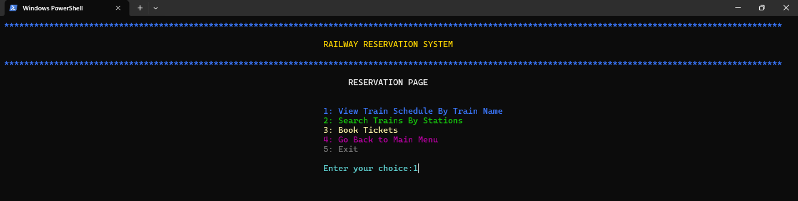

# **RAILWAY RESERVATION SYSTEM**

The Railway Reservation System revolutionizes train travel by providing a user-friendly platform for passengers to book tickets securely online. The system offers various functionalities, ensuring seamless booking and management of train reservations.

## **Features**
1. **User Authentication:**
   - Login with credentials
   - Signup for a new account
   - Update existing password

2. **Booking Process:**
   - Enter journey details (dates, passenger names, origin, destination, preferred class)
   - View available trains and seat/berth options
   - Make electronic payments
   - Generate tickets with assigned PNR numbers

3. **PNR Status Check:**
   - Passengers can check their booking status using the PNR number

4. **Admin Management:**
   - Maintain comprehensive data on trains, fares, and reservations
   - Ensure efficient system management and customer satisfaction

## **Application Usage**
To start the application, compile the `Railway.c` file using the GCC compiler and run the executable:
- **For Linux:** `./a.out`
- **For Windows:** `./a.exe`

## **User Interface Overview**
### **Login Page**  
  
- Enter **1** to log in
- Enter **2** to sign up
- Enter **3** to update an existing password
- Enter **4** to exit the application

### **Main Menu**  
  
- Enter **1** for ticket reservation
- Enter **2** to check PNR status
- Enter **3** to cancel a ticket
- Enter **4** to check CNF (Confirmation) probability
- Enter **5** to exit the application

### **Reservation Menu**  
  
- Enter **1** to view the train schedule by train name
- Enter **2** to view the train schedule by stations
- Enter **3** to book tickets
- Enter **4** to return to the Main Menu
- Enter **5** to exit the application

